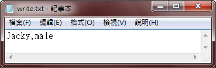

# TQC+ 物件導向程式語言Java 502 寫入資料至文字檔

## 1. 題目說明：
請開啟C:\ANS.CSF\JP05資料夾中的JPD05.java進行編寫。依下列題意進行作答：輸入任意資料，寫入至檔案，再予以輸出，使輸出值符合題意要求。檔案名稱請另存新檔為JPA05.java，儲存於C:\ANS.CSF\JP05資料夾，再進行評分。  
請使用正斜線(/)作為檔案路徑的分隔符號。

## 2. 設計說明：
(1) 請撰寫程式，讓使用者輸入任意資料（單行），輸出使用者的輸入內容並寫入至write.txt檔案中，每一次皆覆蓋上一次的資料，若輸入空值，請輸出【error】，不進行資料寫入。  
(2)請使用print()方法，從write.txt中讀出檔案內容並輸出【write:xxx】。

## 3. 輸入輸出：
### 輸入說明
任意資料

### 輸出說明
將使用者輸入內容寫入至write.txt檔案中。再輸出檔案中的內容（輸出最後一行後不自動換行）

---

### 範例輸入1
```
Jacky,male
```
### 範例輸出1
```
write:Jacky,male
```
