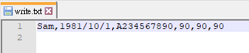

# TQC+ 物件導向程式語言Java 504 文字檔資料新增

## 1. 題目說明：
請開啟C:\ANS.CSF\JP05資料夾中的JPD05.java進行編寫。依下列題意進行作答：輸入三個成績，將資料寫入至檔案，再進行輸出，使輸出值符合題意要求。檔案名稱請另存新檔為JPA05.java，儲存於C:\ANS.CSF\JP05資料夾，再進行評分。  
請使用正斜線(/)作為檔案路徑的分隔符號。

## 2. 設計說明：
(1) 請撰寫程式，讓使用者輸入三個成績（成績之間，以一個半形空格分隔，且0≦成績≦100），將專案中名為new_student的陣列改成以半形逗號分隔的字串，結合同樣以半形逗號分隔的三個成績字串，以附加的方式寫入write.txt檔案中並輸出。若輸入文字、成績未在0~100之間，或輸入格式不合規定的資料，請輸出【error】。

## 3. 輸入輸出：
### 輸入說明
三個成績（成績之間，以一個半形空格分隔，且0≦成績≦100）

### 輸出說明
new_student陣列資料及使用者輸入的成績  
（輸出最後一行後不自動換行）

---

### 範例輸入1
```
90 90 90
```
### 範例輸出1
```
Sam,1981/10/1,A234567890,90,90,90
```

### 範例輸入2
```
90 90 KJ
```
### 範例輸出2
```
error
```