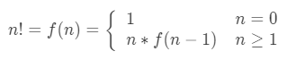

# TQC+ 程式語言(第2版) 306 函式與陣列
最新一次更新時間：2023-05-12 10:29:28

## 1. 題目說明：
請依下列題意進行作答，使輸出值符合題意要求。

## 2. 設計說明：
請撰寫一程式，包含名為compute()的函式，接收主程式傳遞的一個整數n（n ≥ 0），compute()計算n階乘值後回傳至主程式，並輸出n階層結果。

階乘的定義如下：

## 3. 輸入輸出：
### 輸入說明
一個整數n（n ≥ 0）

### 輸出說明
n階層值

---

### 範例輸入
```
7
```
### 範例輸出
```
7!=5040
```