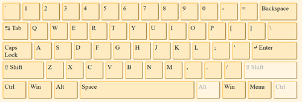

# TQC+ 程式語言(第2版) 406 字串與檔案處理
最新一次更新時間：2023-05-12 10:31:13

## 1. 題目說明：
請依下列題意進行作答，使輸出值符合題意要求。

## 2. 設計說明：
請撰寫一程式，讓使用者輸入一個長度不超過50字元的字串，該字串包含英文大小寫，將每個字元依照鍵盤的位置，輸出它們右邊的大寫或小寫英文字母。若輸入字母的右邊並非英文字母，如「P」、「L」、「M」，則不做更動，原樣輸出。

鍵盤上的英文字母位置圖


## 3. 輸入輸出：
### 輸入說明
一個長度不超過50字元的字串，字串包含英文大小寫

### 輸出說明
依照鍵盤位置，輸出每個字元右邊的大寫或小寫英文字母

---

### 範例輸入
```
NovemBer
```
### 範例輸出
```
MpbrmNrt
```