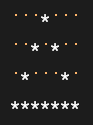

# TQC+ 程式語言(第2版) 510 星號輸出
最新一次更新時間：2023-05-12 10:38:43

## 1. 題目說明：
請依下列題意進行作答，使輸出值符合題意要求。

## 2. 設計說明：
請撰寫一程式，讓使用者輸入兩個正整數n、m，代表n*m矩陣。在矩陣內各別輸入0或1，若矩陣最外圍的輸入為1，則輸出符號「*」；若1的上下左右有其一為0，亦輸出符號「*」；其餘則以半形空格表示，最後將結果輸出在畫面上。

## 3. 輸入輸出：
### 輸入說明
兩個正整數n、m及n*m矩陣中的所有元素（只有0和1）

### 輸出說明
轉換後的結果

---

### 範例輸入
```
4 7
0 0 0 1 0 0 0
0 0 1 1 1 0 0
0 1 1 1 1 1 0
1 1 1 1 1 1 1
```
### 範例輸出
```
   *   
  * *  
 *   * 
*******
```
### 程式輸出擷圖
下圖中的 黃色點 為 空格

