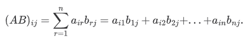

# TQC+ 程式語言(第2版) 610 矩陣乘積
最新一次更新時間：2023-03-31 11:32:41

## 1. 題目說明：
請依下列題意進行作答，使輸出值符合題意要求。

## 2. 設計說明：
請撰寫一程式，讓使用者建立兩個矩陣，先輸入兩個正整數a、b，代表第一個矩陣為a x b矩陣，接著再輸入a x b矩陣的元素；第二個矩陣作法相同，最後輸出兩矩陣相乘的結果，同一列的矩陣元素請使用半形空格隔開，若無法相乘，請輸出「error」。

矩陣乘法：若A是mxn的矩陣，B是nxp的矩陣，則它們的乘積AB是 mxp的矩陣。
    
公式：


## 3. 輸入輸出：
### 輸入說明
兩組矩陣維度及矩陣元素

### 輸出說明
兩矩陣相乘的結果

---

### 範例輸入1
```
2 3
1 2 3
4 5 6
3 2
1 2
3 4
5 6
```
### 範例輸出1
```
22 28
49 64
```
### 範例輸入2
```
2 1
5
5
2 3
4 5 6
7 8 9
```
### 範例輸出2
```
error
```