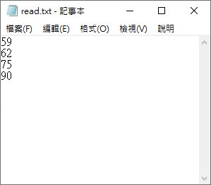
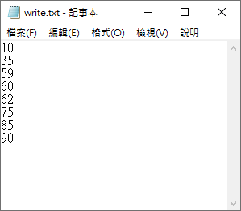

# TQC+ 程式語言(第2版) 706 整數檔案讀寫
最新一次更新時間：2024-04-12 15:03:29

## 1. 題目說明：
請依下列題意進行作答，使輸出值符合題意要求。

## 2. 設計說明：
請撰寫一程式，讓使用者輸入四個整數，並讀取read.txt檔案內容，read.txt檔案中包含多個整數。將輸入值與read.txt檔案中的整數由小而大排序後輸出，並寫入至write.txt檔案。

## 3. 輸入輸出：
### 輸入說明
四個整數，並讀取read.txt檔案內容

### 輸出說明
排序後的結果，並寫入至write.txt檔案

---

### 範例輸入
```
10
35
60
85
```

### 範例輸出
```
10
35
59
60
62
75
85
90
```
